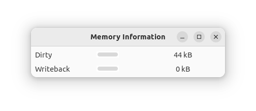

# meminfo-rs

A utility to show the `Dirty` and `Writeback` values from `/proc/meminfo` in a simple window. I 
wanted this so I could easily see the progress of syncing multi-gigabyte files onto a rather slow 
USB stick.



According to the man page for the `/proc` filesystem, the `Dirty` count constitutes:

> Memory which is waiting to get written back to the disk.

While the `Writeback` count is:

> Memory which is actively being written back to the disk.

Thus when both of these approach zero any pending `sync` operation must also be near its conclusion.

Prior to this UI I used the following command that does exactly the same thing from the shell:

```bash
watch grep -e Dirty: -e Writeback: /proc/meminfo
```

## Build and install


This is all built with cargo. Your best bet is to just build and install it yourself. You need
to have the GTK dev library installed first:

```text
sudo apt install libgtk-4-dev
```
Then clone the repo and run the cargo command from the project directory:

```bash
cargo install --path .
```
If anyone's having particular trouble with that I can publish a release x64 version from time to time.

Once installed you can run the tool as `meminfo`

## Observations

This is a pretty clunky way to determine how a sync is progressing (or an eject operation if 
that's how you started it). While it works reasonably well the actual number you see will 
include all files not just whatever subset you're interested in.

## To-do (and done) list...

To Do
  * Supply a .desktop file for Gnome
  * Add reset of highest values feature (so you can narrow the scale if it's showing a stale large maximum value)
  * Maybe allow to drive from list of meminfo field keys?
    * In case someone has a use beyond watching USB drives sync!
    * Maybe make the list configurable?
  * See if there's a way to do something more filesystem or even file specific...? See "Observations" above.
  * Better unit handling/rescaling - it's a bit confusing if both level meters say 240MiB but the dirty meter is a fraction of the size because it started at multiple Gib. 

Done
  * Init from /proc/meminfo
  * Update from /proc/meminfo
  * Add third column with textual representation
  * Removed some unnecessary Arc/Mutex stuff; the ownership can be moved to the receiving thread
  * Made the window resizing less bad (it's still poor though)
  * Make less redundant (the code's pretty primitive)
  * Fix error handling (avoid one unwrap, make another unrecoverable one an expect instead)
  * Improved unit handling (adjusts on the fly to show Gb etc.)
  * Improved the layout more - I'm fairly happy with it now
