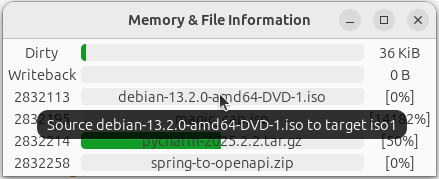

# meminfo-rs

A utility to show the `Dirty` and `Writeback` values from `/proc/meminfo` in a simple window, and also
to track the progress of file copies. I wanted this so I could easily see the progress of syncing 
multi-gigabyte files (ISOs and other images) onto a rather slow USB stick.



According to the man page for the `/proc` filesystem, the `Dirty` count constitutes:

> Memory which is waiting to get written back to the disk.

While the `Writeback` count is:

> Memory which is actively being written back to the disk.

Thus when both of these approach zero any pending `sync` operation must also be near its conclusion.

Prior to this UI I used the following command that does exactly the same thing from the shell:

```bash
watch grep -e Dirty: -e Writeback: /proc/meminfo
```

I've added progress bars for some operations - this steals the general approach from [the `progess` cli tool](https://github.com/Xfennec/progress)
to determine what file-copies (or other READ/WRITE two-file activities) are in operation. That approach (or my version 
of it anyway) is to look for executing binaries matching [various names](#file-progress-executables) and then to look 
at their file descriptors to see which is being read and which is being written. The assumption is that the READ 
descriptor is being copied to the WRITE descriptor. Rows in the UI are distinguished by Process Identifier (PID) but 
a tooltip on hover on the bar describes the name of the source and target files.

## Build and install


This is all built with cargo. Your best bet is to just build and install it yourself. You need
to have the GTK dev library installed first:

```text
sudo apt install libgtk-4-dev
```
Then clone the repo and run the cargo command from the project directory:

```bash
cargo install --path .
```
If anyone's having particular trouble with that I can publish a release x64 version from time to time.

Once installed you can run the tool as `meminfo` - alternatively under Gnome you can set up the desktop file; 
copy the `org.paperstack.Meminfo.desktop` to `$HOME/.local/share/application` optionally editing it to uncomment the
Icon entry and point it at the `meminfo.png` file, and then issue the `update-desktop-database` command
to load the desktop file. You should then be able to run the meminfo command via the search menu (Windows key),
view and invoke it via the Show Apps button, and pin it to the dash (toolbar). 

The old SVG icon was hideous. I replaced it with a ChatGPT generated PNG file instead. A marginal improvement.

## Observations

This is a pretty clunky way to determine how a sync is progressing (or an eject operation if 
that's how you started it). While it works reasonably well the actual number you see will 
include all files not just whatever subset you're interested in.

## File progress executables

Currently the process list is only searched for the following executable names:

* `cp`
* `mv`
* `dd`
* `tar`
* `bsdtar`
* `cat`
* `rsync`
* `scp`
* `grep`
* `fgrep`
* `egrep`
* `cut`
* `sort`
* `cksum`
* `md5sum`
* `sha1sum`
* `sha224sum`
* `sha256sum`
* `sha384sum`
* `sha512sum`
* `adb`
* `gzip`
* `gunzip`
* `bzip2`
* `bunzip2`
* `xz`
* `unxz`
* `lzma`
* `unlzma`
* `7z`
* `7za`
* `zip`
* `unzip`
* `zcat`
* `bzcat`
* `lzcat`
* `coreutils`
* `split`
* `gpg`

The match is done on name only, so if you have something else sharing a name from that list running you might see
its PID in the list and its READ/WRITE file descriptors treated accordingly to generate a progress bar
even if that's not what's going on. Serves you right for not using better names :D

If those processes are doing something that doesn't have at least one READ and one WRITE file descriptor (not
counting stdin, stdout, and stderr) then it won't be listed. If you have more then you will get a progress
bar but it might represent something meaningless.

In order to calculate progress I'm using the approximation of current offset into the input file - in some
cases this could be misleading but I think it's the only reasonable heuristic. In theory one might consume
the whole input file and then spend a long time processing it before completing the output (e.g. in some
pathological gzip case) but I'm skeptical that will come up very often.

Only processes to which the user running meminfo has access will be included in the progress list. 

## To-do (and done) list...

To Do
  * Add reset of highest values feature (so you can narrow the scale if it's showing a stale large maximum value)
  * ~~Maybe allow to drive from list of meminfo field keys?~~
    * ~~In case someone has a use beyond watching USB drives sync!~~
    * ~~Maybe make the list configurable?~~
  * See if there's a way to do something more filesystem or even file specific...? See "Observations" above.
  * Better unit handling/rescaling - it's a bit confusing if both level meters say 240MiB but the dirty meter is a fraction of the size because it started at multiple Gib. 

Done
  * Init from `/proc/meminfo`
  * Update from `/proc/meminfo`
  * Add third column with textual representation
  * Removed some unnecessary Arc/Mutex stuff; the ownership can be moved to the receiving thread
  * Made the window resizing less bad (it's still poor though)
  * Make less redundant (the code's pretty primitive)
  * Fix error handling (avoid one unwrap, make another unrecoverable one an expect instead)
  * Improved unit handling (adjusts on the fly to show Gb etc.)
  * Improved the layout more - I'm fairly happy with it now
  * Supply a `.desktop` & icon file for Gnome
  * Added a "file progress" to the existing buffer progress items.
  * Fix file progress to use the source file offset instead of just observing the output file length.
  * Fix the rendering when I add something to the in-progress processes
